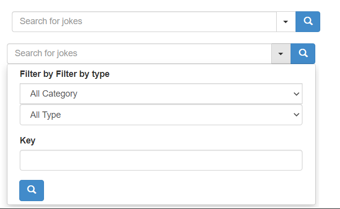

# Optym
Search task project for inteview

What is the objective ?

    1. Read from a url every 8 secs and save it to a Database. Basisc CRUD
    2. Design a basic UI with a text Box, 1 search button for basic search ; url/dropdown for Advanced search And clear button
    3. Key based search on the “setup” and “ punchline” fields
    columns and return all matched jokes.
    4. Advance search Forms should have a Dropdown and 1 text field for search by key
    5. Navigator for latest searches
    6. Extract found jokes into an excel

How to do it ?
    
    We can divide the project into 3 different modules as following:
        1.FeederService for reading data from an endpoint and saving into the DB
        2.SearchSearvice for connecting to any type of DB fed by any feeder
        3.SearchUI for providing essential UI connections to a SearchService
    This kind of module division allows us to decouple the services and make them pluggable.

Simple UI

How to run the services:

    Order of starting the services:
    1. Feeder
    2. Search
    3. Searcher